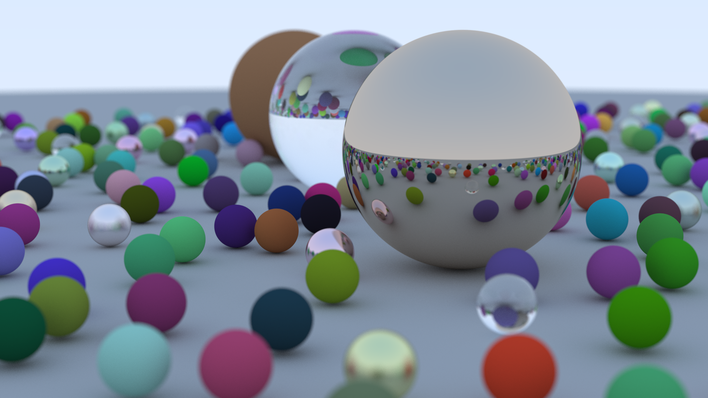

# A simple ray tracer written in C++

This repository is based on the series [Ray Tracing in One Weekend](https://github.com/RayTracing/raytracing.github.io/) and features an implementation of a basic CPU ray tracer.

A sample image, rendered at 1920x1080 using 500 samples per pixel.

Code compiled using C++20 and Clang. Tested on macOS running on Apple Silicon.